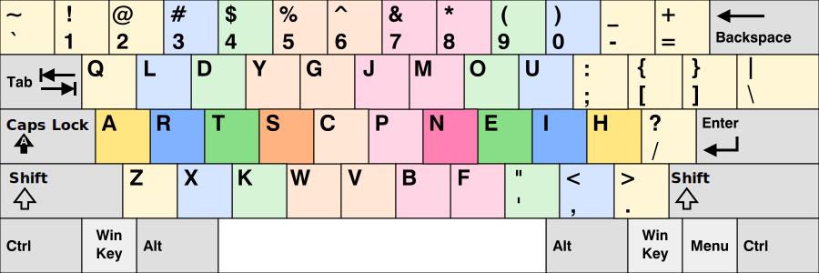
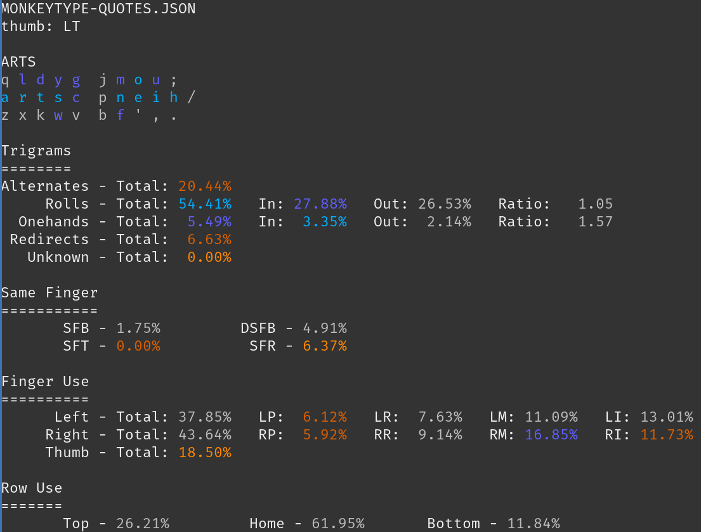

# ARTS

ARTS is a keyboard layout that I designed after using my [pine layout](https://github.com/ClemenPine/pine) for a few months. I wanted a layout that had a high amount of rolls and onehands and a reduced amount of redirects and sfbs - but unlike Pine, I wanted it to have lower pinky movement. I also made it to experiment with an `oe` vowel column and the letter `h` on the pinky. Its name comes from the left-hand homerow. 



# Stats

Here are the stats for the layout as calculated by my layout analyzer, 
- Rolls and Onehands are high compared to other layouts, this means that a lot of trigrams (3-letter combos) are going to be typed in a rolling motion if you use the standard touch-typing technique.
- Redirects are fairly low compared to other layouts. A redirect is a trigram that is typed "out of order".
- SFBs are similar in amount to other optimized layouts. An SFB is a trigram that uses the same finger consequentively. This layout has higher SFBs compared to some layouts, but it puts these SFBs on fingers that are capable of handling the extra use, like the indexes.
  - Also note that these are *trigram* SFBs instead of *bigram* SFBs, which are not the same. On [genkey](https://github.com/semilin/genkey), the SFB score for ARTS is 1.20%
- DSFBs are lower compared to other layouts. These are like SFBs, but separated by one keypress.
- The hands are relatively balanced. Also note that pinky use is slightly lower than other layouts.



# Text

For easy copy-pasting:
```
q l d y g  j m o u ;
a r t s c  p n e i h /
z x k w v  b f ' , .
```

*Created 10 Oct 2021*
